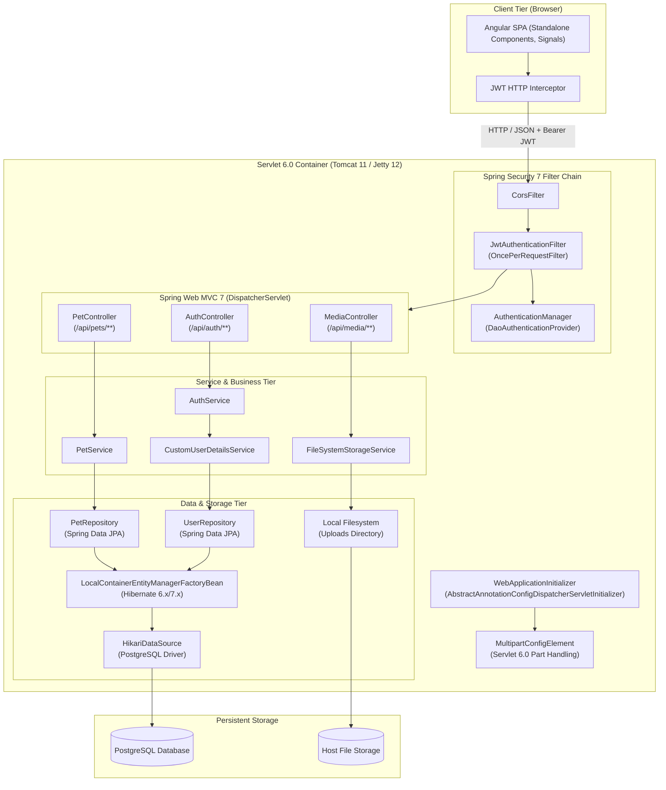

# Step 1: Architecture Blueprint (`ARCHITECTURE.md`)

## 1. System Overview & Architecture Diagram

The Pet Store application is architected as an enterprise-grade, multi-tier full-stack system built on **Java 21**, **Spring Framework 7.x (pure Java-based configuration, zero Spring Boot)**, **Servlet 6.0+**, **PostgreSQL**, and **Angular (latest stable)**.



---

## 2. Multi-Module Maven Repository Layout

The project uses a standard Maven multi-module architecture separating domain entities, business logic, web controllers/configuration, and the frontend client.

```
pet-store-project/
├── pom.xml                               # Root Parent POM (BOM, plugin & dependency management)
├── pet-store-domain/                     # Entity models, Enums, DTOs, Validation annotations
│   ├── pom.xml
│   └── src/main/java/com/petstore/domain/
│       ├── entity/                       # Pet, AppUser, Role
│       ├── enums/                        # PetStatus, UserRole
│       └── dto/                          # PetRequestDTO, PetResponseDTO, LoginRequest, AuthResponse
├── pet-store-service/                    # Spring Data Repositories & Business Logic Services
│   ├── pom.xml
│   └── src/main/java/com/petstore/service/
│       ├── repository/                   # PetRepository, UserRepository
│       ├── service/                      # PetService, AuthService, StorageService
│       ├── exception/                    # ResourceNotFoundException, StorageException, etc.
│       └── mapper/                       # Entity <-> DTO conversion mappers
├── pet-store-web/                        # Spring 7 Web MVC, Security 7, REST API & Bootstrap
│   ├── pom.xml                           # packaging: war (or executable embedded container)
│   └── src/
│       ├── main/java/com/petstore/web/
│       │   ├── config/                   # Java Config: AppConfig, JpaConfig, SecurityConfig, WebMvcConfig, StorageConfig
│       │   ├── controller/               # PetController, MediaController, AuthController
│       │   ├── security/                 # JwtTokenProvider, JwtAuthFilter, SecurityUtils
│       │   └── init/                     # WebAppInitializer (Servlet 6.0 programmatic bootstrap)
│       └── main/resources/
│           ├── application.properties    # DB credentials, JWT secrets, upload paths
│           └── db/migration/             # SQL schema & baseline migrations
└── pet-store-frontend/                   # Angular SPA client (Node/NPM handled via frontend-maven-plugin)
    ├── pom.xml
    ├── package.json
    ├── angular.json
    ├── tsconfig.json
    └── src/
        ├── app/
        │   ├── core/                     # AuthGuard, JwtInterceptor, AuthService, ApiService
        │   ├── features/
        │   │   ├── catalog/              # Public pet grid/list, search, filters
        │   │   ├── pet-detail/           # Detail view modal/page
        │   │   ├── admin-inventory/      # Admin CRUD table, status toggles
        │   │   ├── admin-pet-form/       # Pet create/edit form + image drag-and-drop
        │   │   └── auth/                 # Admin Login modal/page
        │   └── shared/                   # Header, Footer, StatusBadge, ConfirmationModal
        └── assets/
```

---

## 3. Programmatic Spring Framework 7 Bootstrap Architecture

Because Spring Boot is **strictly prohibited**, the application bootstraps purely via the Servlet 6.0 `ServletContainerInitializer` SPI implemented by Spring's `AbstractAnnotationConfigDispatcherServletInitializer`. No `web.xml` exists.

### 3.1. Web Application Initializer (`WebAppInitializer`)

```java
package com.petstore.web.init;

import com.petstore.web.config.AppConfig;
import com.petstore.web.config.JpaConfig;
import com.petstore.web.config.SecurityConfig;
import com.petstore.web.config.StorageConfig;
import com.petstore.web.config.WebMvcConfig;
import jakarta.servlet.MultipartConfigElement;
import jakarta.servlet.ServletRegistration;
import org.springframework.web.servlet.support.AbstractAnnotationConfigDispatcherServletInitializer;

public class WebAppInitializer extends AbstractAnnotationConfigDispatcherServletInitializer {

    // 5 MB max per file, 10 MB max request, 1 MB threshold for disk flush
    private static final long MAX_FILE_SIZE = 5 * 1024 * 1024;
    private static final long MAX_REQUEST_SIZE = 10 * 1024 * 1024;
    private static final int FILE_SIZE_THRESHOLD = 1 * 1024 * 1024;

    @Override
    protected Class<?>[] getRootConfigClasses() {
        return new Class<?>[] {
            AppConfig.class,
            JpaConfig.class,
            SecurityConfig.class,
            StorageConfig.class
        };
    }

    @Override
    protected Class<?>[] getServletConfigClasses() {
        return new Class<?>[] { WebMvcConfig.class };
    }

    @Override
    protected String[] getServletMappings() {
        return new String[] { "/" };
    }

    @Override
    protected void customizeRegistration(ServletRegistration.Dynamic registration) {
        // Register Servlet 6.0 Standard Multipart Config for Multipart/form-data
        MultipartConfigElement multipartConfigElement = new MultipartConfigElement(
            null, // default temp location
            MAX_FILE_SIZE,
            MAX_REQUEST_SIZE,
            FILE_SIZE_THRESHOLD
        );
        registration.setMultipartConfig(multipartConfigElement);
    }
}
```

---

## 4. Programmatic Java Configuration Specifications

### 4.1. Core Application Configuration (`AppConfig`)
*   **Annotations:** `@Configuration`, `@ComponentScan(basePackages = "com.petstore")`, `@PropertySource("classpath:application.properties")`.
*   **Beans:**
    *   `PropertySourcesPlaceholderConfigurer`: Enables `${property.key}` resolution in Java configs.

### 4.2. Database & JPA Configuration (`JpaConfig`)
*   **Annotations:** `@Configuration`, `@EnableTransactionManagement`, `@EnableJpaRepositories(basePackages = "com.petstore.service.repository")`.
*   **Beans:**
    *   `DataSource`: Programmatically instantiates `HikariDataSource` reading `db.url`, `db.username`, `db.password`, and `db.driver-class-name`. Connection pool parameters: max pool size 10, min idle 2, connection timeout 30000ms.
    *   `LocalContainerEntityManagerFactoryBean`: Configured with `HibernateJpaVendorAdapter`, pointing to packages `com.petstore.domain.entity`. Sets Hibernate properties (`hibernate.dialect=org.hibernate.dialect.PostgreSQLDialect`, `hibernate.show_sql=false`, `hibernate.hbm2ddl.auto=validate`).
    *   `PlatformTransactionManager`: Instantiates `JpaTransactionManager(entityManagerFactory)`.
    *   `PersistenceExceptionTranslationPostProcessor`: Translates native JPA/Hibernate exceptions into Spring's `DataAccessException` hierarchy.

### 4.3. Spring MVC Configuration (`WebMvcConfig`)
*   **Annotations:** `@Configuration`, `@EnableWebMvc`, implements `WebMvcConfigurer`.
*   **Configurations:**
    *   **CORS:** Configures `CorsRegistry` permitting Angular client origin (`http://localhost:4200` or production host), allowing methods `GET, POST, PUT, DELETE, OPTIONS, PATCH`, headers `*`, credentials `true`.
    *   **Message Converters:** Configures `MappingJackson2HttpMessageConverter` with `ObjectMapper` registering `JavaTimeModule` for ISO-8601 `Instant`/`LocalDate` serialization without timestamps.
    *   **Static Resource Handlers:** Exposes Angular client bundle if packaged within WAR or leaves root routes to Angular router.

### 4.4. Spring Security 7 Configuration (`SecurityConfig`)
*   **Annotations:** `@Configuration`, `@EnableWebSecurity`.
*   **Beans:**
    *   `SecurityFilterChain`:
        *   CSRF disabled (`csrf(AbstractHttpConfigurer::disable)`) for stateless token-based REST APIs.
        *   CORS enabled linking to WebMvc CORS configuration.
        *   Session Management: `SessionCreationPolicy.STATELESS`.
        *   Authorization Rules:
            *   Permit All: `POST /api/auth/login`, `GET /api/pets/**`, `GET /api/media/**`, `/actuator/health` (if present).
            *   Secured (`hasAuthority('ROLE_ADMIN')`): `POST /api/pets/**`, `PUT /api/pets/**`, `DELETE /api/pets/**`, `POST /api/media/**`, `DELETE /api/media/**`, `GET /api/auth/me`.
            *   All other requests: `authenticated()`.
        *   Filter Insertion: Inserts `JwtAuthenticationFilter` before `UsernamePasswordAuthenticationFilter.class`.
    *   `PasswordEncoder`: Instantiates `BCryptPasswordEncoder(12)`.
    *   `AuthenticationManager`: Programmatically configured using `AuthenticationConfiguration` or `DaoAuthenticationProvider(userDetailsService, passwordEncoder)`.

### 4.5. Storage Configuration (`StorageConfig`)
*   **Annotations:** `@Configuration`.
*   **Beans:**
    *   `StorageProperties`: Encapsulates `${app.storage.upload-dir:uploads}`.
    *   `FileSystemStorageService`: Initializes storage directory upon bean creation (`Files.createDirectories(rootLocation)`), verifies read/write filesystem permissions, and throws fail-fast exceptions if the storage volume is unavailable.

---

## 5. Storage Subsystem & Dynamic Media Serving

### 5.1. File Storage Service Flow
1.  **Request Ingestion:** Controller receives `jakarta.servlet.http.Part` (or `MultipartFile`).
2.  **MIME & Extension Validation:** Inspects content type against whitelist (`image/jpeg`, `image/png`, `image/webp`). Validates that filename does not contain relative directory navigation patterns (`..`).
3.  **UUID Filename Generation:** File is persisted as `UUID.randomUUID().toString() + "." + extension`.
4.  **Local Filesystem Write:** Bytes are streamed directly into the isolated root location path using `java.nio.file.Files.copy(inputStream, destination, StandardCopyOption.REPLACE_EXISTING)`.
5.  **URL Formulation:** Returns relative resource URI: `/api/media/{generatedFilename}` stored in `Pet.photoUrl`.

### 5.2. Media Serving Architecture
*   `GET /api/media/{filename}`
*   Resolves file path securely using `rootLocation.resolve(filename).normalize()`.
*   Guards against directory traversal (`path.startsWith(rootLocation)`).
*   Returns `ResponseEntity<Resource>` with:
    *   `Content-Type`: Automatically detected (`image/jpeg`, `image/png`, `image/webp`).
    *   `Cache-Control`: `public, max-age=86400, immutable`.
    *   `ETag`: Generated from file size and last modified timestamp for browser caching.

---

## 6. Frontend Architecture (100% Signal-First Angular)

*   **Modular Organization:** Decoupled Angular project placed under `pet-store-frontend/`.
*   **Architecture Pattern:** Modern Angular Standalone Components without NgModules, utilizing a **100% Signal-First reactive design**:
    *   **Signal Inputs & Outputs:** Components exclusively use `input<T>()`, `input.required<T>()`, `output<T>()`, and `model<T>()`. Legacy `@Input()`, `@Output()`, and `EventEmitter` decorators are prohibited.
    *   **Signal Queries:** View and content querying done via `viewChild()` and `viewChildren()`.
    *   **State & Computed Reactivity:**
        *   `signal()` for mutable state (active filters, view mode `grid | list`, current page, modals, loading indicators).
        *   `computed()` for all derived state (total pages, filtered result counts, price calculations, auth status).
        *   `effect()` for controlled side effects (e.g., syncing query parameters with router or updating local storage).
*   **Authentication & Interception:**
    *   `AuthStore`: A dedicated signal-based service:
        *   `currentUser = signal<UserProfile | null>(null)`
        *   `isAuthenticated = computed(() => !!this.currentUser())`
        *   `isAdmin = computed(() => this.currentUser()?.role === 'ROLE_ADMIN')`
    *   `JwtInterceptor`: Implements `HttpInterceptorFn` attaching `Authorization: Bearer <token>` to all `/api/**` calls when an active token exists. Handles `401 Unauthorized` by clearing the auth signal and redirecting to the login dialog.
*   **Catalog & Inventory State Stores:**
    *   `CatalogStore`: Signal-driven store managing search term, selected category, selected breed, price range, view mode, page number, and pet results using `toSignal()` or `rxResource` for clean async lifecycle management.
*   **Build Pipeline:**
    *   Integrated into the Maven lifecycle using `frontend-maven-plugin`.
    *   `mvn clean install` runs `npm install` and `npm run build`.
    *   Angular dist output can be packaged into the WAR's static root (`META-INF/resources`) or served via an external reverse proxy (e.g., NGINX).
