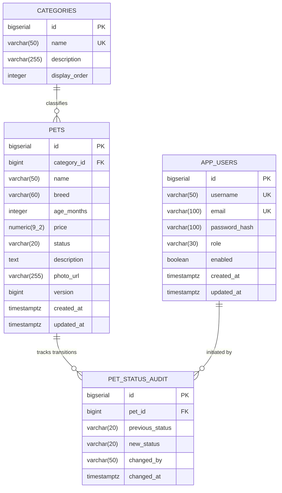

# Step 3: Database Schema Specification (`SCHEMA.md`)

## 1. Overview & Database Architecture

The Pet Store persistence tier uses **PostgreSQL 16+** with relational integrity constraints, foreign key cascades/restrictions, check constraints, optimistic locking, and indexed search pathways.

Database migrations are executed deterministically on application bootstrap using **Flyway** configured programmatically via Spring 7 Java configuration, executing before Hibernate's `EntityManagerFactory` validates schema contracts.

---

## 2. Entity-Relationship (ER) Diagram



---

## 3. Relational Table Specifications & Constraints

### 3.1. `categories` Table
Stores normalized species/category classifications for faceted search and data integrity.

```sql
CREATE TABLE categories (
    id BIGSERIAL PRIMARY KEY,
    name VARCHAR(50) NOT NULL,
    description VARCHAR(255),
    display_order INT NOT NULL DEFAULT 0,
    CONSTRAINT uq_categories_name UNIQUE (name)
);
```

### 3.2. `pets` Table
Primary entity record storing pet inventory and listing details.

```sql
CREATE TABLE pets (
    id BIGSERIAL PRIMARY KEY,
    category_id BIGINT NOT NULL,
    name VARCHAR(50) NOT NULL,
    breed VARCHAR(60) NOT NULL,
    age_months INT NOT NULL,
    price NUMERIC(9, 2) NOT NULL,
    status VARCHAR(20) NOT NULL DEFAULT 'AVAILABLE',
    description TEXT,
    photo_url VARCHAR(255),
    version BIGINT NOT NULL DEFAULT 0,
    created_at TIMESTAMPTZ NOT NULL DEFAULT CURRENT_TIMESTAMP,
    updated_at TIMESTAMPTZ NOT NULL DEFAULT CURRENT_TIMESTAMP,
    
    CONSTRAINT fk_pets_category FOREIGN KEY (category_id) 
        REFERENCES categories(id) ON DELETE RESTRICT,
    CONSTRAINT chk_pets_age CHECK (age_months >= 0 AND age_months <= 360),
    CONSTRAINT chk_pets_price CHECK (price >= 0.00),
    CONSTRAINT chk_pets_status CHECK (status IN ('AVAILABLE', 'PENDING', 'ADOPTED'))
);
```

### 3.3. `pet_status_audit` Table
Immutable audit trail capturing all state transitions across pet lifecycles.

```sql
CREATE TABLE pet_status_audit (
    id BIGSERIAL PRIMARY KEY,
    pet_id BIGINT NOT NULL,
    previous_status VARCHAR(20),
    new_status VARCHAR(20) NOT NULL,
    changed_by VARCHAR(50),
    changed_at TIMESTAMPTZ NOT NULL DEFAULT CURRENT_TIMESTAMP,

    CONSTRAINT fk_audit_pet FOREIGN KEY (pet_id) 
        REFERENCES pets(id) ON DELETE CASCADE
);
```

### 3.4. `app_users` Table
Database credentials and authorization roles for Spring Security JWT authentication.

```sql
CREATE TABLE app_users (
    id BIGSERIAL PRIMARY KEY,
    username VARCHAR(50) NOT NULL,
    email VARCHAR(100) NOT NULL,
    password_hash VARCHAR(100) NOT NULL,
    role VARCHAR(30) NOT NULL DEFAULT 'ROLE_ADMIN',
    enabled BOOLEAN NOT NULL DEFAULT TRUE,
    created_at TIMESTAMPTZ NOT NULL DEFAULT CURRENT_TIMESTAMP,
    updated_at TIMESTAMPTZ NOT NULL DEFAULT CURRENT_TIMESTAMP,

    CONSTRAINT uq_users_username UNIQUE (username),
    CONSTRAINT uq_users_email UNIQUE (email)
);
```

---

## 4. Indexing & Query Optimization Strategy

To guarantee sub-millisecond response times for marketplace catalog queries and multi-faceted searches:

### 4.1. B-Tree Indexes
*   **Compound Catalog Filter Index:**
    ```sql
    CREATE INDEX idx_pets_status_created ON pets(status, created_at DESC);
    ```
    *Accelerates default public queries fetching `AVAILABLE` pets ordered by newest listing.*

*   **Category & Breed Composite Index:**
    ```sql
    CREATE INDEX idx_pets_category_status ON pets(category_id, status);
    CREATE INDEX idx_pets_breed ON pets(breed);
    ```
    *Speeds up faceted category and breed selection dropdowns and count aggregations.*

*   **Price Filtering & Sorting Index:**
    ```sql
    CREATE INDEX idx_pets_price ON pets(price);
    ```
    *Optimizes price range boundary queries (`minPrice <= price <= maxPrice`) and price-ascending/descending sorts.*

### 4.2. Trigram & Full-Text Search (GIN Indexes)
Enables fuzzy matching and keyword searches across pet names and descriptions:

```sql
CREATE EXTENSION IF NOT EXISTS pg_trgm;

CREATE INDEX idx_pets_name_trgm ON pets USING gin (name gin_trgm_ops);
CREATE INDEX idx_pets_breed_trgm ON pets USING gin (breed gin_trgm_ops);
```

---

## 5. Standalone Flyway Migration Architecture (Without Spring Boot)

### 5.1. Programmatic Spring 7 Integration
Flyway runs programmatically as a Spring `@Bean` inside `JpaConfig` with an explicit dependency order ensuring migration completion before the `LocalContainerEntityManagerFactoryBean` initializes:

```java
@Bean(initMethod = "migrate")
public Flyway flyway(DataSource dataSource) {
    return Flyway.configure()
        .dataSource(dataSource)
        .locations("classpath:db/migration")
        .baselineOnMigrate(true)
        .load();
}

@Bean
@DependsOn("flyway")
public LocalContainerEntityManagerFactoryBean entityManagerFactory(DataSource dataSource) {
    // Standard JPA initialization guaranteed to find migrated schema
    ...
}
```

---

## 6. Migration SQL Scripts

### 6.1. `V1__init_schema.sql`
```sql
-- Enable PostgreSQL Trigram Extension for text search
CREATE EXTENSION IF NOT EXISTS pg_trgm;

-- 1. Categories
CREATE TABLE categories (
    id BIGSERIAL PRIMARY KEY,
    name VARCHAR(50) NOT NULL,
    description VARCHAR(255),
    display_order INT NOT NULL DEFAULT 0,
    CONSTRAINT uq_categories_name UNIQUE (name)
);

-- 2. Pets
CREATE TABLE pets (
    id BIGSERIAL PRIMARY KEY,
    category_id BIGINT NOT NULL,
    name VARCHAR(50) NOT NULL,
    breed VARCHAR(60) NOT NULL,
    age_months INT NOT NULL,
    price NUMERIC(9, 2) NOT NULL,
    status VARCHAR(20) NOT NULL DEFAULT 'AVAILABLE',
    description TEXT,
    photo_url VARCHAR(255),
    version BIGINT NOT NULL DEFAULT 0,
    created_at TIMESTAMPTZ NOT NULL DEFAULT CURRENT_TIMESTAMP,
    updated_at TIMESTAMPTZ NOT NULL DEFAULT CURRENT_TIMESTAMP,
    CONSTRAINT fk_pets_category FOREIGN KEY (category_id) REFERENCES categories(id) ON DELETE RESTRICT,
    CONSTRAINT chk_pets_age CHECK (age_months >= 0 AND age_months <= 360),
    CONSTRAINT chk_pets_price CHECK (price >= 0.00),
    CONSTRAINT chk_pets_status CHECK (status IN ('AVAILABLE', 'PENDING', 'ADOPTED'))
);

-- 3. Pet Status Audit
CREATE TABLE pet_status_audit (
    id BIGSERIAL PRIMARY KEY,
    pet_id BIGINT NOT NULL,
    previous_status VARCHAR(20),
    new_status VARCHAR(20) NOT NULL,
    changed_by VARCHAR(50),
    changed_at TIMESTAMPTZ NOT NULL DEFAULT CURRENT_TIMESTAMP,
    CONSTRAINT fk_audit_pet FOREIGN KEY (pet_id) REFERENCES pets(id) ON DELETE CASCADE
);

-- 4. App Users (Security)
CREATE TABLE app_users (
    id BIGSERIAL PRIMARY KEY,
    username VARCHAR(50) NOT NULL,
    email VARCHAR(100) NOT NULL,
    password_hash VARCHAR(100) NOT NULL,
    role VARCHAR(30) NOT NULL DEFAULT 'ROLE_ADMIN',
    enabled BOOLEAN NOT NULL DEFAULT TRUE,
    created_at TIMESTAMPTZ NOT NULL DEFAULT CURRENT_TIMESTAMP,
    updated_at TIMESTAMPTZ NOT NULL DEFAULT CURRENT_TIMESTAMP,
    CONSTRAINT uq_users_username UNIQUE (username),
    CONSTRAINT uq_users_email UNIQUE (email)
);

-- Indices
CREATE INDEX idx_pets_status_created ON pets(status, created_at DESC);
CREATE INDEX idx_pets_category_status ON pets(category_id, status);
CREATE INDEX idx_pets_breed ON pets(breed);
CREATE INDEX idx_pets_price ON pets(price);
CREATE INDEX idx_pets_name_trgm ON pets USING gin (name gin_trgm_ops);
CREATE INDEX idx_pets_breed_trgm ON pets USING gin (breed gin_trgm_ops);
```

### 6.2. `V2__seed_initial_data.sql`
```sql
-- Seed Standard Taxonomy Categories
INSERT INTO categories (name, description, display_order) VALUES
('Dog', 'Canine companions of all breeds and ages', 1),
('Cat', 'Feline friends, kittens, and domestic breeds', 2),
('Bird', 'Parrots, canaries, and companion birds', 3),
('Fish', 'Freshwater and saltwater aquarium fish', 4),
('Reptile', 'Turtles, lizards, and small terrarium pets', 5),
('Small Animal', 'Rabbits, hamsters, guinea pigs', 6),
('Other', 'Miscellaneous pet varieties', 7);

-- Seed Initial Administrator Account (password: "Admin123!" using BCrypt work factor 12)
-- Hash generated via BCrypt: $2a$12$K1r6fQ8W0t3yU2MhFh5oqe8C1t6i9b1m4o2.p4r7s8t9u0v1w2x3y
INSERT INTO app_users (username, email, password_hash, role, enabled) VALUES
('admin', 'admin@petstore.internal', '$2a$12$K1r6fQ8W0t3yU2MhFh5oqe8C1t6i9b1m4o2.p4r7s8t9u0v1w2x3y', 'ROLE_ADMIN', TRUE);

-- Seed Sample Pets
INSERT INTO pets (category_id, name, breed, age_months, price, status, description, photo_url) VALUES
(1, 'Bailey', 'Golden Retriever', 24, 450.00, 'AVAILABLE', 'Friendly, playful, fully vaccinated and loves outdoor activities.', NULL),
(1, 'Rocky', 'German Shepherd', 36, 500.00, 'AVAILABLE', 'Alert, highly intelligent, trained in basic commands.', NULL),
(2, 'Luna', 'Siamese', 14, 300.00, 'AVAILABLE', 'Affectionate and vocal companion who enjoys lounging in sunny spots.', NULL),
(2, 'Oliver', 'Maine Coon', 8, 420.00, 'PENDING', 'Large, gentle kitten with silky coat and gentle disposition.', NULL),
(3, 'Kiwi', 'Budgerigar', 6, 45.00, 'AVAILABLE', 'Cheerful whistler with bright green plumage.', NULL),
(5, 'Spike', 'Bearded Dragon', 18, 120.00, 'ADOPTED', 'Calm and easy to handle; well acclimated to terrarium living.', NULL);
```
